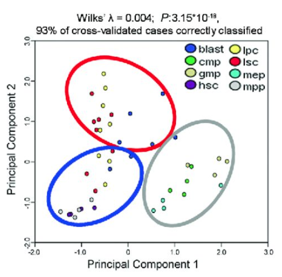
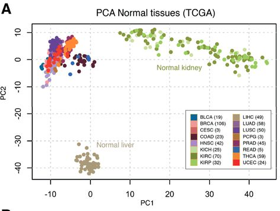

微信ID: epigenomics  E-mail: epigenomics@rainbow-genome.com

本代码作者：徐洲更<https://www.jianshu.com/u/9ea40b5f607a>


小丫编辑校验

```{r setup, include=FALSE}
knitr::opts_chunk$set(echo = TRUE)
```

### 需求描述

用TCGA数据画主成分分析(pricinple components analysis，PCA)的图。

例如：[画个小圈圈](https://mp.weixin.qq.com/s/8kqTVSDjuHpivGaim6ukNg)里的这个图：




出自<http://www.haematologica.org/content/102/7/e245>



出自<http://clincancerres.aacrjournals.org/content/23/8/2105.figures-only>

### 应用场景

通常我们拿到的数据集，例如转录组的表达量矩阵都有成千上万个基因，这类高维度数据很难直接进行可视化展示。

为了能够在二维平面上展示，就需要对其进行降维，而PCA分析是目前最常用的降维工具。

然后你就能在图上一眼看出哪些样品之间更像，哪些样品属于/不属于同一组。不仅适用于测序数据。

场景一：多个分组，每组三次生物学重复。做PCA，看到某个样品远离了组内其他样品，它有什么问题？

场景二：多个分组，分三批送去测序。做PCA，看不出分组的规律，却看到同一批次的样品间距离更近，批次效应？

### 输入数据

两个输入文件:

- 表达量矩阵：easy_input_expr.csv，第一列是样品名，后续几列是各个基因的表达量，或者其他属性
- 样品分组：easy_input_meta.csv，第一列是样品名，第二列是分组

此处输入数据为3种癌症BRCA、OV、LUSC里，5个基因"GATA3", "PTEN", "XBP1","ESR1", "MUC1"的表达量。

数据来源：用R包`RTCGA.mRNA`提取TCGA数据。也可参考FigureYa18、21（临床信息）、FigureYa22、23、34（表达矩阵）里的数据下载方法。

```{r}
expr_df <- read.csv(file='easy_input_expr.csv',row.names = 1, 
                    header = TRUE, sep=",", stringsAsFactors = FALSE)
meta_df <- read.csv(file='easy_input_meta.csv', row.names = 1,
                    header = TRUE, sep=",",stringsAsFactors = FALSE)
#查看前3个基因在前4个sample中的表达矩阵
expr_df[1:3,1:4]
#查看样本信息前3行
head(meta_df, n=3)
```

### 做PCA

```{r,fig.width=6,fig.height=6}
#用`prcomp`进行PCA分析
pca.results <- prcomp(expr_df, center = TRUE, scale. = FALSE)

#定义足够多的颜色，用于展示分组
mycol <- c("#223D6C","#D20A13","#088247","#FFD121","#11AA4D","#58CDD9","#7A142C","#5D90BA","#431A3D","#91612D","#6E568C","#E0367A","#D8D155","#64495D","#7CC767")
```

### 开始画图

这里提供两种方法：

- 方法一：自动画图。用现成的R包全自动画图，必要时只需调整参数。

- 方法二：提取PCA分析结果，手动画图。

#### 方法一：自动画图

用到做PCA的R包`ggord`，优点是能用背景色展示置信区间，缺点是没有画圈功能。

Y叔对ggord进行了加强，放在R包`yyplot`里，详情看这篇：<https://mp.weixin.qq.com/s/iA0IuyRx_Ojk639sxenmvg>。yyplot包里提供的`geom_ord_ellipse`能画出多个圆圈，用来展示不同的置信区间，并且可以反复叠加，想画几个圈就画几个圈。

#####经典版

```{r}
#install.packages("devtools")
#library(devtools)
#devtools::install_github("GuangchuangYu/yyplot")
#devtools::install_github('fawda123/ggord')
library(ggplot2)
library(plyr)
library(ggord)
#library(yyplot)

#有可能你的网络在安装yyplot时遇到困难，我把geom_ord_ellipse函数单独下载，通过本地进行加载。
#调用yyplot包里的geom_ord_ellipse函数
source('./geom_ord_ellipse.R') #该文件位于当前文件夹

#用ggord画基本PCA图
ggord(pca.results, grp_in = meta_df$group, repel=TRUE,
      ellipse = FALSE, #不显示置信区间背景色
      size = 2, #样本的点大小
      alpha=0.5, #设置点为半透明，出现叠加的效果
      #如果用自定义的颜色，就运行下面这行
      cols = mycol[1:length(unique(meta_df$group))],
      arrow = NULL,txt = NULL) + #不画箭头和箭头上的文字
  theme(panel.grid =element_blank()) + #去除网格线
  
  #用yyplot添加置信区间圆圈
  geom_ord_ellipse(ellipse_pro = .95, #设置置信区间
                   size=1.5, #线的粗细
                   lty=1 ) #实线

#保存到pdf文件
ggsave("PCA_classic.pdf", width = 6, height = 6)
```

#####箭头版

```{r}
#用ggord画基本PCA图和置信区间背景色
ggord(pca.results, grp_in = meta_df$group, repel=TRUE,
      alpha = 0.6,#点和置信区间背景设为半透明，以凸显箭头和文字
      #或者单独修改置信区间背景的透明度
      #alpha_el = 0.3,
      ellipse_pro = 0.95,#置信区间
      size = 2,
      #如果想用默认的颜色，就在下面这行前面加个#
      #cols = mycol[1:length(unique(meta_df$group))],
      arrow=0.2, #箭头的头的大小
      vec_ext = 5,#箭头尾巴长短
      veccol="brown",#箭头颜色
      txt=3) + #箭头指向的基因名的字体大小
  theme(panel.grid =element_blank()) + 
  
  #用yyplot继续添加虚线的置信区间
  geom_ord_ellipse(ellipse_pro = .95, #先画个.95的圆圈
                   color='darkgrey', #圈圈的颜色
                   size=0.5, 
                   lty=2 ) + #画成虚线，可以用1-6的数字设置为其他线型
  geom_ord_ellipse(ellipse_pro = .98, #再画个.98的圆圈
                   #color='grey', #把这行注释掉，就是跟点一样的颜色
                   size=0.5, lty=2 ) 

#保存到pdf文件
ggsave("PCA_arrow.pdf", width = 6, height = 6)
```

#### 方法二：提取PCA分析结果，手动画图

##### 从PCA结果到画图所需的输入数据整理

用`prcomp`进行PCA分析后，获取降维后每个样本对应的主成分值和每个主成分的解释的变异。

```{r,message=FALSE}
#install.packages("ggplot2")
#install.packages("dplyr")
#install.packages("plyr")
library(ggplot2)
library(dplyr)
library(plyr)

pca.rotation <- pca.results$rotation
pca.rotation
pca.pv <- summary(pca.results)$importance[2,]
pca.pv
```

调整数据结构，用于作图

提取前两个主成分构建数据框，并增加分组信息列

```{r}
low_dim_df <- as.data.frame(pca.results$x[,c(1,2)])
low_dim_df$group <- meta_df$group
#查看前3行
low_dim_df[1:3,]
```

下面以PCA分析得到的"low\_dim\_df"作为输入，画图

##### 画置信区间圆圈的函数

先运行函数`add_ellipase`，用来增加置信区间椭圆线。

通过调整参数，以达到你想要的效果，参数含义为：

- p: ggplot2返回的对象
- x,y: 主成分的列名
- group: 分组列
- ellipse_pro: 置信区间，默认0.95
- linetype可选类型: blank, solid, dashed, dotted, dotdash, longdash, twodash
- colour：颜色
- lwd：线的粗细

```{r}
add_ellipase <- function(p, x="PC1", y="PC2", group="group",
                         ellipase_pro = 0.95,
                         linetype="dashed",
                         colour = "black",
                         lwd = 2,...){
  obs <- p$data[,c(x, y, group)]
  colnames(obs) <- c("x", "y", "group")
  ellipse_pro <- ellipase_pro
  theta <- c(seq(-pi, pi, length = 50), seq(pi, -pi, length = 50))
  circle <- cbind(cos(theta), sin(theta))
  ell <- ddply(obs, 'group', function(x) {
    if(nrow(x) <= 2) {
      return(NULL)
    }
    sigma <- var(cbind(x$x, x$y))
    mu <- c(mean(x$x), mean(x$y))
    ed <- sqrt(qchisq(ellipse_pro, df = 2))
    data.frame(sweep(circle %*% chol(sigma) * ed, 2, mu, FUN = '+'))
    })
  names(ell)[2:3] <- c('x', 'y')
  
  ell <- ddply(ell, .(group) , function(x) x[chull(x$x, x$y), ])
  p <- p + geom_polygon(data = ell, aes(x=x,y=y,group = group), 
                   colour = colour,
                   alpha = 1,fill = NA,
                   linetype=linetype,
                   lwd =lwd)
  return(p)
}
```

##### 开始画图

```{r}
#计算坐标轴标签
pc1.pv <- paste0(round(pca.pv['PC1'],digits = 3) * 100, "%")
pc2.pv <- paste0(round(pca.pv['PC2'],digits = 3) * 100, "%")

#画出各个样本在二维空间的点
p <- ggplot(low_dim_df) + 
  geom_point(aes(x=PC1, y=PC2, color=group), size=2, #点的大小
             shape=20,#点的形状
             alpha=0.5) +#设置点为半透明，出现叠加的效果
  #如果使用默认的颜色，就在下面这行前面加个#
  scale_color_manual(values = mycol[1:length(unique(meta_df$group))]) +
  #还能调整整体的颜色亮度
  #scale_colour_hue(l=45) + 
  theme_bw() + #去除背景色
  theme(panel.grid =element_blank()) + #去除网格线
  
  #添加标签，同样可以加到方法一的同一位置
  annotate("text",x=-8.5,y=-1.2,label = "BRCA",color = mycol[1]) +
  annotate("text",x=5,y=5.6,label = "LUCA",color = mycol[2]) +
  annotate("text",x=5,y=-2.5,label = "OV",color = mycol[3]) +
  
  #图例
  guides(color=guide_legend(title = NULL)) +
  theme(legend.background = element_blank(), #移除整体边框
        #图例的左上角置于绘图区域的左上角
        legend.position = c(0,1),legend.justification = c(0,1),
        legend.text = element_text(size=12)) + #字体大小

  #调整坐标轴标签
  xlab(paste0("PC1 ( ", pc1.pv," variance )")) + 
  ylab(paste0("PC2 ( ", pc2.pv," variance )")) 
p
#画圈圈
p1 <- add_ellipase(p,ellipase_pro = 0.95,colour = "dimgrey",linetype=1,lwd=1)
p1
#保存为PDF文件
ggsave('PCA_DIY1.pdf',width = 5.5,height = 4)

#也可以多次叠加，画两个圆圈
p2 <- add_ellipase(p,ellipase_pro = 0.95,colour = "dimgrey",linetype=2,lwd=0.5)
p2 <- add_ellipase(p2,ellipase_pro = 0.98,colour = "dimgrey",linetype=2,lwd=0.5)
p2

#保存为PDF文件
ggsave('PCA_DIY2.pdf',width = 5.5,height = 4)
```


### 附录

之前提到三个癌症的全称

- BRCA: Breast invasive carcinoma
- OV: Ovarian serous cystadenocarcinoma
- LUSC: Lung squamous cell carcinoma

```{r}
sessionInfo()
```
